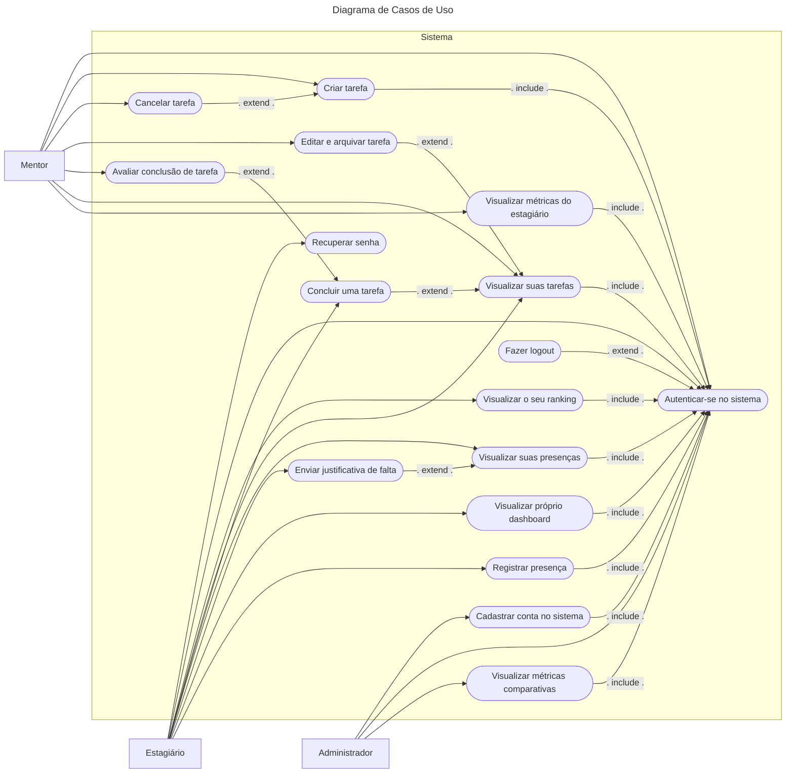
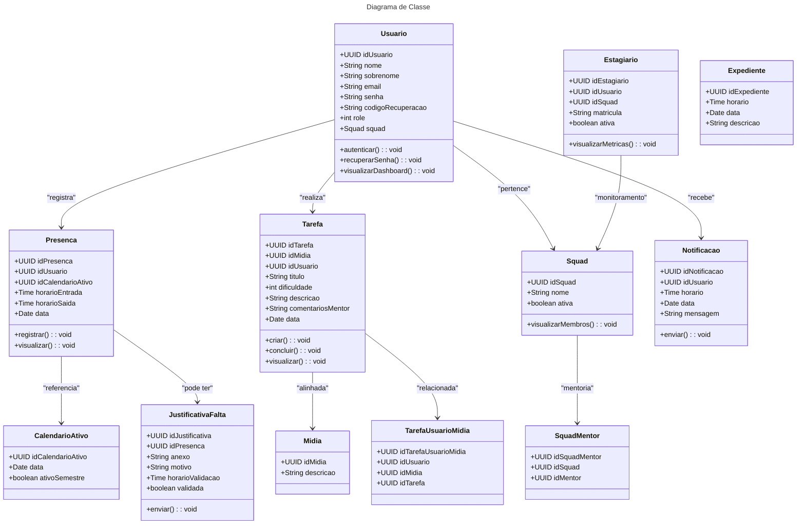

O projeto Checkpoint é um aplicativo em React-Typescript que visa facilitar o gerenciamento de estagiários, por meio de um sistema de cadastro de tarefas que podem ser concluídas e registro de presença automatizado que podem ser facilmente acessados e lidos por meio de dashboards e relatórios automaticamente criados.

O processo de gestão de estagiários requer um investimento considerável de tempo, que em muitos casos é detrimental a produtividade e seus gestores, o Checkpoint visa reduzir o tempo gasto neste processo por meio de um aplicativo intuitivo e de fácil uso, acesso aos dados relevantes em multiplas formas visualização, para o uso mais fácil, eficiente e rápido.

Documentação
https://docs.google.com/document/d/1pGp7fBkgc4rtjkurOUZEJAsxfCGPo3NcEaC-q_ZKlwY/edit?usp=sharing

